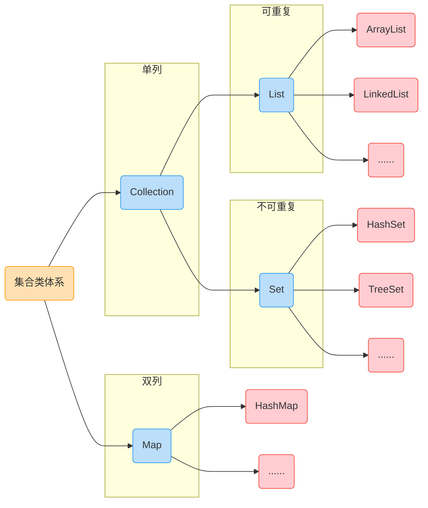

# 1. 集合体系结构

## 1.1 Collection

### 1.1.1 集合的知识回顾

集合类的特点：提供了一种存储空间可变的存储模型，存储的数据容量可以随时发生改变

### 1.1.2 集合类体系结构



**==注==：图中蓝色图示均为接口，红色图示均为其对应实现类**

### 1.1.3 Collection集合的概述和使用

#### 1. Collection集合概述

- 是单列集合的顶层接口，它表示一组对象，这些对象也称为 Collection 元素
- JDK 不提供此接口的任何直接实现，它提供更具体的子接口(如 Set 和 List )实现

#### 2. 创建Collection集合的对象

- 多态的方式
- 具体的实现类 ArrayList

#### 3. 参考代码

```java
import java.util.ArrayList;
import java.util.Collection;

/**
 * 创建Collection集合的对象
 * 多态的方式
 * ArrayList()
 */
public class CollectionDemo01 {
    public static void main(String[] args) {
        // 创建Collection集合的对象
        Collection<String> c = new ArrayList<String>();

        // 添加元素：boolean add(E e)
        c.add("hello");
        c.add("world");
        c.add("java");

        // 输出集合对象
        System.out.println(c);
    }
}

```

### 1.1.4 Collection 集合常用方法

#### 1. 常用方法

| 方法名                       | 说明                               |
| ---------------------------- | ---------------------------------- |
| `boolean add(E e)`           | 添加元素                           |
| `boolean remove(Object o)`   | 从集合中移除指定元素               |
| `void clear()`               | 清空集合中的元素                   |
| `boolean contains(Object o)` | 判断集合中是否存在指定的元素       |
| `boolean isEmpty()`          | 判断集合是否为空                   |
| `int size()`                 | 集合的长度，也就是集合中元素的个数 |

#### 2. 参考代码

```java
/**
 * Collection 集合常用方法：
 *  boolean add(E e)：添加元素
 *  boolean remove(Object o)：从集合中移除指定的元素
 *  void clear()：清空集合中的元素
 *  boolean contains(Object o)：判断集合中是否存在指定的元素
 *  boolean isEmpty()：判断集合是否为空
 *  int size()：集合的长度，也就是集合中元素的个数
 *
 *  Alt + 7 快捷键，可以打开一个窗口能看到类的所有信息
 */
public class CollectionDemo02 {
    public static void main(String[] args) {
        // 创建Collection集合的对象
        Collection<String> c = new ArrayList<String>();

        // boolean add(E e)：添加元素
        // System.out.println(c.add("hello"));
        // System.out.println(c.add("world"));
        // System.out.println(c.add("world"));
        c.add("hello");
        c.add("world");
        c.add("java");

        // boolean remove(Object o)：从集合中移除指定的元素
        // System.out.println(c.remove("world"));
        // System.out.println(c.remove("javaee"));

        // void clear()：清空集合中的元素
        // c.clear();
        
        // boolean contains(Object o)：判断集合中是否存在指定的元素
        // System.out.println(c.contains("world"));
        // System.out.println(c.contains("javaee"));
        
        // boolean isEmpty()：判断集合是否为空
        // System.out.println(c.isEmpty());
        
        // int size()：集合的长度，也就是集合中元素的个数
        System.out.println(c.size());

        // 输出集合对象
        System.out.println(c);
    }
}

```

### 1.1.5 Collection 集合的遍历

#### 1. Iterator 迭代器概述

- Iterator迭代器，集合的专用遍历方式
  - `Iterator<E> iterator()`：返回此集合元素中的迭代器，通过集合的 `iterator()` 方法得到
  - 迭代器是通过集合的 `iterator()` 方法得到的，所以我们说它是依赖于集合而存在的

- Iterator 迭代器中的常用方法
  - `E next()`：返回迭代中的下一个元素
  - `boolean hasNext()`：如果迭代具有更多元素，则返回 true

#### 2. 参考代码

```java
import java.util.ArrayList;
import java.util.Collection;
import java.util.Iterator;

/**
 * Iterator：迭代器，集合的专用遍历方式
 *  Iterator<E> iterator()：返回此集合中元素的迭代器，通过集合的iterator()方法得到
 *  迭代器是通过iterator()方法得到的，所以我们说它是依赖于集合而存在的
 *
 * Iterator中的常用方法
 *  E next()：返回集合中的下一个元素
 *  boolean hasNext()：如果迭代具有更多元素，则返回true
 */
public class IteratorDemo {
    public static void main(String[] args) {
        // 创建集合对象
        Collection<String> c = new ArrayList<String>();

        c.add("hello");
        c.add("world");
        c.add("java");

        // Iterator<E> iterator()：返回此集合中元素的迭代器，通过集合的iterator()方法得到
        Iterator<String> it = c.iterator();

        /*
        public Iterator<E> iterator() {
            return new ArrayList.Itr();
        }

        private class Itr implements Iterator<E> {
            ....
        }
         */

        // E next()：返回迭代中的下一个元素
        /*
        System.out.println(it.next());
        System.out.println(it.next());
        System.out.println(it.next());
        System.out.println(it.next());  // NoSuchElementException：表示被请求的元素不存在
         */

        // boolean hasNext()：如果迭代器具有更多元素，则返回true
        /*
        if(it.hasNext()) {
            System.out.println(it.next());
        }
        if(it.hasNext()) {
            System.out.println(it.next());
        }
        if(it.hasNext()) {
            System.out.println(it.next());
        }
        if(it.hasNext()) {
            System.out.println(it.next());
        }
         */

        // 用while循环改进判断
        while(it.hasNext()) { 
            // System.out.println(it.next());
            String s = it.next();
            System.out.println(s);
        }
    }
}
```

### 1.1.6 集合的使用步骤


==Sorce Link==：https://1drv.ms/p/s!Atmd1rID6xjMhLVoktJOiTR3_Y4v1A

### 1.1.7 案例：Collecton集合存储学生对象并遍历

#### 1. 案例概述

- 需求：创建一个存储学生对象的集合，存储三个学生对象，使用程序实现在控制台遍历该集合
- 思路：
  1. 定义学生类
  2. 创建 Collection 集合对象
  3. 创建学生对象
  4. 把学生添加到集合
  5. 遍历集合(迭代器方式)

#### 2. 代码实现

==CollectionDemo类==

```java
public class CollectionDemo {
    public static void main(String[] args) {
        // 创建 Collection 集合对象
        Collection<Student> collection = new ArrayList<>();

        // 创建学生对象
        Student s1 = new Student("Linda", 20);
        Student s2 = new Student("Mika", 35);
        Student s3 = new Student("Wing", 33);

        // 把学生添加到集合
        collection.add(s1);
        collection.add(s2);
        collection.add(s3);

        // 遍历集合(迭代器方式)
        Iterator<Student> iterator = collection.iterator();
        while(iterator.hasNext()) {
            Student student = iterator.next();
            System.out.println(student.toString());
        }

    }
}
```

==Student类==

```java
public class Student {
    private String name;
    private int age;

    public Student() {
    }

    public Student(String name, int age) {
        this.name = name;
        this.age = age;
    }

    public String getName() {
        return name;
    }

    public void setName(String name) {
        this.name = name;
    }

    public int getAge() {
        return age;
    }

    public void setAge(int age) {
        this.age = age;
    }

    @Override
    public String toString() {
        return "Student{" +
                "name='" + name + '\'' +
                ", age=" + age +
                '}';
    }
}
```

## 1.2 List 概述

### 1.2.1 List 集合的概述和特点

#### 1. List 集合概述

- 有序集合(也称为序列)，用户可以精确控制列表中每个元素的插入位置。用户可以通过整数索引访问元素。
  并搜索列表中的元素
- 与 Set 集合不同，列表通常允许重复的元素

#### 2. List 集合特点

- 有序：存储和取出元素的顺序一致
- 可重复：存储的元素可以重复

#### 3. 参考代码

```java
import java.util.ArrayList;
import java.util.Iterator;
import java.util.List;

/**
 * List 集合特点
 *  有序：存储和取出元素的顺序一致
 *  可重复性：存储的元素可以重复
 */
public class ListDemo01 {
    public static void main(String[] args) {
        // 创建集合对象
        List<String> list = new ArrayList<>();

        // 添加元素
        list.add("hello");
        list.add("world");
        list.add("java");
        list.add("world");

        // 输出集合对象
        System.out.println(list);
        
        // 迭代器的方式遍历
        Iterator<String> it = list.iterator();
        while(it.hasNext()) {
            String s = it.next();
            System.out.println(s);
        }
    }
}
```

### 1.2.2 List 集合特有方法

#### 1. List集合特有方法

| 方法名                           | 说明                                     |
| -------------------------------- | ---------------------------------------- |
| `void add(int index, E element)` | 此集合中的指定位置插入指定               |
| `E remove(int index)`            | 删除指定索引处的元素，返回被删除的元素   |
| `E set(int index, E element)`    | 修改指定索引位置的元素，返回被修改的元素 |
| `E get(int index)`               | 返回指定索引处的元素                     |

#### 2. 参考代码

```java
import java.util.ArrayList;
import java.util.List;

/**
 * List 集合特有方法
 *  void add(int index, E element)：在此集合中的指定位置插入指定的元素
 *  E remove(int index)：删除指定索引处的元素，返回被删除的元素
 *  E set(int index, E element)：修改指定索引处的元素，返回被修改的元素
 *  E get(int index)：返回指定索引处的元素
 */
public class ListDemo02 {
    public static void main(String[] args) {
        // 创建集合对象
        List<String> list = new ArrayList<>();

        // 添加元素
        list.add("hello");
        list.add("world");
        list.add("java");

        // void add(int index, E element)：在此集合中的指定位置插入指定的元素
        // list.add(1, "javaee");
        // IndexOutOfBoundsException
        // list.add(11, "javaee");

        // E remove(int index)：删除指定索引处的元素，返回被删除的元素
        // System.out.println(list.remove(1));
        // IndexOutOfBoundsException
        // System.out.println(list.remove(11));

        // E set(int index, E element)：修改指定索引处的元素，返回被修改的元素
        System.out.println(list.set(1, "javaee"));
        // IndexOutOfBoundsException
        System.out.println(list.set(11, "javaee"));

        // E get(int index)：返回指定索引处的元素
        System.out.println(list.get(1));
        // IndexOutOfBoundsException
        System.out.println(list.get(11));

        // 输出集合对象
        System.out.println(list);

        // 遍历集合
        System.out.println(list.get(0));
        System.out.println(list.get(1));
        System.out.println(list.get(2));

        // 用for循环改进遍历
        for(int i = 0; i < list.size(); i++) {
            String s = list.get(i);
            System.out.println(s);
        }
    }
}
```

### 1.2.3 案例：List 集合存储学生对象并遍历

#### 1. 案例概述

- 需求：创建一个存储学生对象的集合，存储三个学生对象，使用程序实现在控制台遍历该集合
- 思路：
  1. 定义学生类
  2. 创建List集合对象
  3. 创建学生对象
  4. 把学生添加到集合
  5. 遍历集合(迭代器方式、for 循环方式)

#### 2. 代码实现

```java
import java.util.ArrayList;
import java.util.Iterator;
import java.util.List;

/**
 * 需求：创建一个存储学生对象的集合，存储三个学生对象，使用程序实现在控制台遍历该集合
 * 思路：
 *      1. 定义学生类
 *      2. 创建List集合对象
 *      3. 创建学生对象
 *      4. 把学生添加到集合
 *      5. 遍历集合(迭代器方式、for循环方式)
 */
public class ListDemo {
    public static void main(String[] args) {
        // 创建List集合对象
        List<Student> list = new ArrayList<>();

        // 创建学生对象
        Student s1 = new Student("Linda", 30);
        Student s2 = new Student("Mika", 32);
        Student s3 = new Student("Wing", 33);

        // 把学生添加到集合
        list.add(s1);
        list.add(s2);
        list.add(s3);

        // 迭代器方式
        Iterator<Student> it = list.iterator();
        while(it.hasNext()) {
            Student s = it.next();
            System.out.println(s.toString());
        }

        // for循环方式
        for(int i = 0; i < list.size(); i++) {
            Student s = list.get(i);
            System.out.println(s.toString());
        }
    }
}
```

### 1.2.4 并发修改异常

#### 1. 产生异常代码分析

```java
import java.util.ArrayList;
import java.util.Iterator;
import java.util.List;

/**
 * 需求：
 *  我有一个集合：List<String> list = new Arraylist<String>();
 *  里面有三个元素：list.add("hello"); list.add("world"); list.add("java");
 *  遍历集合，得到每一个元素，看有没有”world“这个元素，我就添加一个”javaee“元素，请写代码实现
 *
 * ConcurrentModificationException：当不允许这样的修改时，就可以通过检测到对象的并发修改的方法来抛出异常
 */
public class ListDemo {
    public static void main(String[] args) {
        // 创建集合对象
        List<String> list = new ArrayList<>();

        // 添加元素
        list.add("hello");
        list.add("world");
        list.add("java");

        // 遍历集合，得到每一个元素，看有没有”world“这个元素，我就添加一个”javaee“元素，请写代码实现
        Iterator<String> it = list.iterator();
        while(it.hasNext()) {
            String s = it.next();
            if(s.equals("world")) {
                list.add("javaee");
            }
        }

        // 通过 for 循环遍历
        for(int i = 0; i < list.size(); i++) {
            if(list.get(i).equals("world")) {
                list.add("javaee");
            }
        } 

        // 输出集合对象
        System.out.println(list);
    }
}
```

#### 2. 源码分析

```java
public interface List<E> extends Collection<E> {
    Iterator<E> iterator();
    boolean add(E e);
}

public abstract class AbstractList<E> {
    protected int modCount = 0;
}

public class ArrayList<E> extends AbstractList<E>
        implements List<E>, RandomAccess, Cloneable, java.io.Serializable {
    public boolean add(E e) {
        ensureCapacityInternal(size + 1);  // Increments modCount!! 增加modCount!!
        elementData[size++] = e;
        return true;
    }

    public E get(int index) {
        rangeCheck(index);

        return elementData(index);
    }
    
    public Iterator<E> iterator() {
        return new Itr();
    }

    private class Itr implements Iterator<E> {
        int cursor;       // index of next element to return
        int lastRet = -1; // index of last element returned; -1 if no such
        int expectedModCount = modCount;

        /**
         * modCount：实际修改集合的次数
         * expectedModCount：逾期修改集合次数
         */

        Itr() {
        }

        public boolean hasNext() {
            return cursor != size;
        }

        @SuppressWarnings("unchecked")
        public E next() {
            checkForComodification();
            int i = cursor;
            if (i >= size)
                throw new NoSuchElementException();
            Object[] elementData = ArrayList.this.elementData;
            if (i >= elementData.length)
                throw new ConcurrentModificationException();
            cursor = i + 1;
            return (E) elementData[lastRet = i];
        }

        final void checkForComodification() {
            if (modCount != expectedModCount)
                throw new ConcurrentModificationException();
        }
    }
}
```

#### 3. 原因分析

- 并发修改异常
  ConcurrentModificationException

- 产生原因
  迭代器遍历过程中，通过集合对象修改了集合中元素的长度，造成了迭代器获取元素中判断预期修改值和实际修改值不一样

- 解决方案

  用 for 循环遍历，然后集合对象做对应的操作即可

### 1.2.5 ListIterator 列表迭代器

#### 1. ListIterator 概述

- ListIterator：列表迭代器
  - 通过 List 集合的 `listIterator()` 方法得到。所以说他是 List 集合特有的迭代器
  - 用于允许程序员沿着任一方向遍历列表的列表迭代器，在迭代期间修改列表，并获取列表中迭代器当前的位置
- ListIterator 中的常用方法
  - `E next()`：返回迭代中的下一个元素
  - `boolean hasNext()`：如果迭代器具有更多元素，则返回 true
  - `E previous()`：返回列表中的上一个元素
  - `boolean hasPreviuos()`：如果此列表迭代器在相反方向遍历列表时具有更多元素，则返回 true
  - `void add(E e)`：将指定的元素插入列表

#### 2. 参考代码

```java
import java.util.ArrayList;
import java.util.List;
import java.util.ListIterator;

/**
 * ListIterator：列表迭代器
 *  通过 List 集合的 ListIterator() 方法得到，所以说它是 List 集合特有的迭代器
 *  用于允许程序员沿着任一方向遍历列表的列表迭代器，在迭代期间修改列表，并获得列表中迭代器的当前位置
 *
 * ListIterator 中的常用方法
 *  E next()：返回迭代中的下一个元素
 *
 */
public class ListIteratorDemo {
    public static void main(String[] args) {
        // 创建集合对象
        List<String> list = new ArrayList<>();

        // 添加元素
        list.add("hello");
        list.add("world");
        list.add("java");

        // 通过 List 集合的 listIterator() 方法得到
        ListIterator<String> listIterator = list.listIterator();

        while(listIterator.hasNext()) {
            String s = listIterator.next();
            System.out.println(s);
        }
        System.out.println("-------");

        while(listIterator.hasPrevious()) {
            String s = listIterator.previous();
            System.out.println(s);
        }

        // 获取列表迭代器
        ListIterator<String> lit = list.listIterator();
        while(lit.hasNext()) {
            String s = lit.next();
            if(s.equals("world")) {
                lit.add("javaee");
            }
        }

        System.out.println(list);
    }
}
```

#### 3. ListIterator 与并发修改异常

在 ListIterator 中使用 `add()` 方法时不会触发[并发修改异常](#1.2.4 并发修改异常)，因为在 ListIterator 的 `add()` 方法中会将实际修改值赋值给预期修改值，具体的源码分析如下：

```java
public interface List<E> extends Collection<E> {
    ListIterator<E> listIterator();
}

public abstract class AbstractList<E> {
    protected int modCount = 0;
}

public class ArrayList<E> extends AbstractList<E>
        implements List<E>, RandomAccess, Cloneable, java.io.Serializable {
    public boolean add(E e) {
        ensureCapacityInternal(size + 1);  // Increments modCount!! 增加modCount!!
        elementData[size++] = e;
        return true;
    }

    public E get(int index) {
        rangeCheck(index);

        return elementData(index);
    }

    public ListIterator<E> listIterator() {
        return new ListItr(0);
    }

    private class ListItr extends Itr implements ListIterator<E> {
        ListItr(int index) {
            super();
            cursor = index;
        }

        public boolean hasPrevious() {
            return cursor != 0;
        }

        public int nextIndex() {
            return cursor;
        }

        public int previousIndex() {
            return cursor - 1;
        }

        @SuppressWarnings("unchecked")
        public E previous() {
            checkForComodification();
            int i = cursor - 1;
            if (i < 0)
                throw new NoSuchElementException();
            Object[] elementData = ArrayList.this.elementData;
            if (i >= elementData.length)
                throw new ConcurrentModificationException();
            cursor = i;
            return (E) elementData[lastRet = i];
        }

        public void set(E e) {
            if (lastRet < 0)
                throw new IllegalStateException();
            checkForComodification();

            try {
                ArrayList.this.set(lastRet, e);
            } catch (IndexOutOfBoundsException ex) {
                throw new ConcurrentModificationException();
            }
        }

        public void add(E e) {
            checkForComodification();

            try {
                int i = cursor;
                ArrayList.this.add(i, e);
                cursor = i + 1;
                lastRet = -1;
                expectedModCount = modCount; // 会将实际修改值赋值给预期修改值
            } catch (IndexOutOfBoundsException ex) {
                throw new ConcurrentModificationException();
            }
        }
    }
}
```

### 1.2.6 增强 for 循环

#### 1. 增强 for 循环概述

- 增强 for 循环：简化数组和 Collection 集合的遍历
  - 实现 Iterable 接口的类允许其对象成为增强 for 语句的目标
  
  - 它是 JDK5 之后出现的，其内部原理是一个 Iterator 迭代器
  
    
  
- 增强 for 的格式

  ```java
  /**
   * 增强 for 格式
   */
  for(元素数据类型 变量名 : 数组或 Collection 组合) {
  // 在此处使用变量即可，该变量就是元素
  }
  ```

  ```java
  /**
   * 增强 for 范例
   */
  int[] arr = {1, 2, 3, 4, 5};
  for(int i : arr) {
      System.out.print(i);
  }
  ```

#### 2. 参考代码

```java
import java.util.*;

/**
 * 增强 for ：简化数组和 Collection 集合的遍历
 *  实现 Iterable 接口的类允许其成为增强型 for 语句的目标
 *  它是 JDK5 之后出现的， 其内部原理是一个 Iterator 迭代器
 * 格式：
 *  for(元素数字据类型 变量名 : 数组或者 Collection 集合) {
 *      // 此处使用变量即可，该变量就是元素
 *  }
 */
public class ForDemo {
    public static void main(String[] args) {
        int[] arr = {1, 2, 3, 4, 5};
        for(int i : arr) {
            System.out.println(i);
        }

        System.out.println("--------");

        String[] strArray = {"hello", "world", "java"};
        for(String s : strArray) {
            System.out.println(s);
        }
        System.out.println("--------");

        List<String> list = new ArrayList<>();
        list.add("hello");
        list.add("world");
        list.add("java");

        for(String s : list) {
            System.out.println(s);
        }

        // 内部原理是一个 Iterator 迭代器
        for(String s : list) {
            if(s.equals("world")) {
                list.add("javaee");  // ConcurrentModificationException
            }
        }
    }
}
```

### 1.2.7 案例：List 集合存储学生对象用三种方式遍历

#### 1. 案例概述

- 需求：创建一个存储学生对象的集合，存储三个学生对象，使用程序实现在控制台遍历该集合
- 思路：
  1. 定义学生类
  2. 创建List集合对象
  3. 创建学生对象
  4. 把学生添加到集合
  5. 遍历集合
     - 迭代器：集合特有的遍历方式
     - 普通 for ： 带有索引的遍历方式
     - 增强 for ：最方便的遍历方式

#### 2. 实现代码

==Student 学生类==

```java
public class Student {
    private String name;
    private int age;

    public Student() {
    }

    public Student(String name, int age) {
        this.name = name;
        this.age = age;
    }

    public String getName() {
        return name;
    }

    public void setName(String name) {
        this.name = name;
    }

    public int getAge() {
        return age;
    }

    public void setAge(int age) {
        this.age = age;
    }

    @Override
    public String toString() {
        return "Student{" +
                "name='" + name + '\'' +
                ", age=" + age +
                '}';
    }
}
```

==ListDemo 类==

```java
import java.util.ArrayList;
import java.util.Iterator;
import java.util.List;

/**
 * 需求：创建一个存储学生对象的集合，存储三个学生对象，使用程序实现在控制台遍历该集合
 * 思路：
 *      1. 定义学生类
 *      2. 创建List集合对象
 *      3. 创建学生对象
 *      4. 把学生添加到集合
 *      5. 遍历集合
 *          - 迭代器：集合特有的遍历方式
 *          - 普通 for ： 带有索引的遍历方式
 *          - 增强 for ：最方便的遍历方式
 */
public class ListDemo {
    public static void main(String[] args) {
        // 创建List集合对象
        List<Student> list = new ArrayList<>();

        // 创建学生对象
        Student s1 = new Student("Linda", 30);
        Student s2 = new Student("Mika", 32);
        Student s3 = new Student("Wing", 33);

        // 把学生添加到集合
        list.add(s1);
        list.add(s2);
        list.add(s3);

        // 迭代器方式：集合特有的遍历方式
        Iterator<Student> it = list.iterator();
        while(it.hasNext()) {
            Student s = it.next();
            System.out.println(s.toString());
        }
        System.out.println("--------");

        // for 循环方式：带有索引的遍历方式
        for(int i = 0; i < list.size(); i++) {
            Student s = list.get(i);
            System.out.println(s.toString());
        }
        System.out.println("--------");

        // 增强 for ： 最方便的遍历方式
        for(Student student : list) {
            System.out.println(student.toString());
        }
    }
}
```

## 1.3 常见数据结构

数据结构是计算机存储、组织数据的方式。是指相互之间存在的一种或多种特定关系的数据元素的集合
通常情况下，精心选择的数据结构可以带来更高的运行或存储效率

### 1.3.1 数据结构之栈和队列

#### 1. 常见数据结构之栈


#### 2. 常见数据结构之队列


### 1.3.2 数据结构之数组和链表

#### 1. 数据结构之数组


#### 2. 数据结构之链表


### 1.3.3 常见数据结构之链表

- 此部分参见：[1.5.5 常见数据结构之哈希表](#1.5.5 常见数据结构之哈希表)

## 1.4 List 集合的子类

### 1.4.1 List 集合常见子类的特点

#### 1. List 集合常见子类特点概述

List 集合常见子类：ArrayList 与 LinkedList

- ArrayList：底层数据结构是数组，查询快，增删慢
- LinkedList：底层数据结构，查询慢，增删快

- 练习：分别使用 ArrayList 和 LinkedList 完成存储字符串并遍历

#### 2. 参考代码

```java
import java.util.ArrayList;
import java.util.LinkedList;
import java.util.ListIterator;

/**
 * List 集合常用子类：ArrayList， LinkedList
 *  ArrayList：底层数据结构是数组，查询快，增删慢
 *  LinkedList：底层数据结构是链表，查询慢，增删快
 *
 * 练习：
 *  分别使用 ArrayList 和 LinkedList 完成字符串的存储并遍历
 */
public class ListDemo {
    public static void main(String[] args) {
        // 创建集合对象
        ArrayList<String> arrayList = new ArrayList<>();

        arrayList.add("hello");
        arrayList.add("world");
        arrayList.add("java");

        // 增强 for 遍历
        for(String s : arrayList) {
            System.out.println(s);
        }
        System.out.println("--------");

        // 普通 for 遍历
        for(int i = 0; i < arrayList.size(); i++) {
            System.out.println(arrayList.get(i));
        }
        System.out.println("--------");

        // 迭代器遍历
        ListIterator<String> listIterator = arrayList.listIterator();
        while(listIterator.hasNext()) {
            System.out.println(listIterator.next());
        }

        // LinkedList
        LinkedList<String> linkedList = new LinkedList<>();
        linkedList.add("hello");
        linkedList.add("world");
        linkedList.add("java");

        // 增强 for 遍历
        for(String s : linkedList) {
            System.out.println(s);
        }
        System.out.println("--------");

        // 普通 for 遍历
        for(int j = 0; j < linkedList.size(); j++) {
            System.out.println(linkedList.get(j));
        }
        System.out.println("--------");

        // 迭代器遍历
        ListIterator<String> iterator = linkedList.listIterator();
        while(iterator.hasNext()) {
            System.out.println(iterator.next());
        }
    }
}
```

### 1.4.2 案例: ArrayList 集合存储学生对象三种遍历方式

#### 1. 案例概述

- 需求：创建一个存储学生对象的集合，存储三个学生对象，使用程序实现在控制台遍历该集合
- 思路：
  1. 定义学生类
  2. 创建ArrayList集合对象
  3. 创建学生对象
  4. 把学生添加到集合
  5. 遍历集合
     - 迭代器：集合特有的遍历方式
     - 普通 for ： 带有索引的遍历方式
     - 增强 for ：最方便的遍历方式

#### 2. 实现代码

```java
import java.util.ArrayList;
import java.util.Iterator;

/**
 * 需求：创建一个存储学生对象的集合，存储三个学生对象，使用程序实现在控制台遍历该集合
 * 思路：
 *      1. 定义学生类
 *      2. 创建ArrayList集合对象
 *      3. 创建学生对象
 *      4. 把学生添加到集合
 *      5. 遍历集合
 *          - 迭代器：集合特有的遍历方式
 *          - 普通 for ： 带有索引的遍历方式
 *          - 增强 for ：最方便的遍历方式
 */
public class ArrayListDemo {
    public static void main(String[] args) {
        // 创建List集合对象
        ArrayList<Student> arrayList = new ArrayList<>();

        // 创建学生对象
        Student s1 = new Student("Linda", 30);
        Student s2 = new Student("Mika", 32);
        Student s3 = new Student("Wing", 33);

        // 把学生添加到集合
        arrayList.add(s1);
        arrayList.add(s2);
        arrayList.add(s3);

        // 迭代器方式：集合特有的遍历方式
        Iterator<Student> it = arrayList.iterator();
        while(it.hasNext()) {
            Student s = it.next();
            System.out.println(s.toString());
        }
        System.out.println("--------");

        // for 循环方式：带有索引的遍历方式
        for(int i = 0; i < arrayList.size(); i++) {
            Student s = arrayList.get(i);
            System.out.println(s.toString());
        }
        System.out.println("--------");

        // 增强 for ： 最方便的遍历方式
        for(Student student : arrayList) {
            System.out.println(student.toString());
        }
    }
}
```

### 1.4.3 LinkedList 集合的特有功能

#### 1. 特有功能

| 方法名                      | 说明                             |
| --------------------------- | -------------------------------- |
| `public void addFirst(E e)` | 在该列表开头插入指定的元素       |
| `public void addLast(E e)`  | 将指定的元素追加到此列表的末尾   |
| `public E getFirst()`       | 返回此列表中的第一个元素         |
| `pulic E getLast()`         | 返回此列表中的最后一个元素       |
| `public E removeFirst()`    | 从此列表中删除第一个元素并返回   |
| `public E removeLast()`     | 从此列表中删除最后一个元素并返回 |

#### 2. 参考代码

```java
import java.util.LinkedList;

/**
 * LinkedList集合的特有功能:
 *  public void addFirst(E e): 在该列表开头插入指定的元素
 *  public void addLast(E e): 将指定元素追加到此列表的末尾
 *
 *  public E getFirst(): 返回此列表中的最后一个元素
 *  public E getLast(): 返回此列表中的最后一个元素
 *
 *  public E removeFirst(): 从此列表中删除并返回第一个元素
 *  public E removeLast(): 从此列表中删除并返回最后一个元素
 */
public class LinkedListDemo {
    public static void main(String[] args) {
        // 创建集合对象
        LinkedList<String> linkedList = new LinkedList<>();

        linkedList.add("hello");
        linkedList.add("world");
        linkedList.add("java");

        // public void addFirst(E e): 在该列表开头插入指定的元素
        // public void addLast(E e): 将指定元素追加到此列表的末尾
        linkedList.addFirst("java-se");
        linkedList.addLast("java-se");

        // public E getFirst(): 返回此列表中的最后一个元素
        // public E getLast(): 返回此列表中的最后一个元素
        System.out.println(linkedList.getFirst());
        System.out.println(linkedList.getLast());

        // public E removeFirst(): 从此列表中删除并返回第一个元素
        // public E removeLast(): 从此列表中删除并返回最后一个元素
        System.out.println(linkedList.removeFirst());
        System.out.println(linkedList.removeLast());

        System.out.println(linkedList);

    }
}
```

## 1.5 Set 集合

### 1.5.1 Set 集合概述和特点

#### 1. 概述和特点

- Set 集合特点
  - 不包含重复元素的集合
  - 没有带索引的方法, 所以不能使用普通 for 循环遍历

- Set 集合练习: 存储字符串并遍历

#### 2. 参考代码

```java
import java.util.HashSet;
import java.util.Set;

/**
 * HashSet 集合特点
 * 1：底层数据结构是哈希表
 * 2：对集合的迭代顺序不做任何保证，也就是说不保证存储和取出的元素顺序一致
 * 3：没有带索引的方法，所以不能使用普通 for 循环遍历
 * 4：由于是 Set 集合，所以是不包含重复元素的集合
 */
public class HashSetDemo {
    public static void main(String[] args) {
        // 创建集合对象
        Set<String> hashSet = new HashSet<>();

        // 添加元素
        hashSet.add("hello");
        hashSet.add("world");
        hashSet.add("java");

        // 不包含重复元素的集合
        hashSet.add("world");

        // 遍历
        for(String s : hashSet) {
            System.out.println(s);
        }
    }
}
```

### 1.5.2 哈希值

#### 1. 概述

- 哈希值：是 JDK 根据对象的==地址==或者==字符串==或者==数字==算出来的 int 类型的==数值==
- Object 类中有一个方法可以获取==对象的哈希值==
  - `public int hashCode()`：返回对象的哈希值

#### 2. 参考代码

==HashDemo==

```java
/**
 * 哈希值：
 *  是 JDK 根据对象的地址或者字符串或者数字算出来的 int 类型的数值
 *
 * Object 类中有一个方法可以获取对象的哈希值
 *  public int hashCode()：返回对象的哈希值
 */
public class HashDemo {
    public static void main(String[] args) {
        // 创建学生对象
        Student s1 = new Student("林青霞", 30);

        // 同一个对象多次调用 hashCode() 方法返回的哈希值是相同的
        System.out.println(s1.hashCode());  // 460141958
        System.out.println(s1.hashCode());  // 460141958

        System.out.println("--------");

        // 默认情况下，不同对象的哈希值是不相同的
        // 通过方法重写，可以实现不同对象的哈希值是相同的
        Student s2 = new Student("林青霞", 30);
        System.out.println(s2.hashCode());  // 1163157884

        System.out.println("--------");

        System.out.println("hello".hashCode());  // 99162322
        System.out.println("world".hashCode());  // 113318802
        System.out.println("java".hashCode());  // 3254818

        System.out.println("--------");

        System.out.println("world".hashCode());  // 113318802

        System.out.println("--------");

        System.out.println("重地".hashCode());  // 1179395
        System.out.println("通话".hashCode());  // 1179395
    }
}
```

==Student==

```java
public class Student {
    private String name;
    private int age;

    public Student() {
    }

    public Student(String name, int age) {
        this.name = name;
        this.age = age;
    }

    public String getName() {
        return name;
    }

    public void setName(String name) {
        this.name = name;
    }

    public int getAge() {
        return age;
    }

    public void setAge(int age) {
        this.age = age;
    }

    @Override
    public String toString() {
        return "Student{" +
                "name='" + name + '\'' +
                ", age=" + age +
                '}';
    }
}
```

### 1.5.3 HashSet 集合概述和特点

#### 1. 概述与特点

- HashSet 集合特点
  - 底层数据结构是哈希表
  - 对集合的迭代顺序不做任何保证，也就是说不保证存储和取出的元素顺序一致
  - 没有带索引的方法，所以不能使用普通 for 循环遍历
  - 由于是 Set 集合，所以是不包含重复元素的集合
- HashSet 集合练习：存储字符串并遍历

#### 2. 参考代码

```java
import java.util.HashSet;

public class HashSetDemo01 {
    public static void main(String[] args) {
        // 创建集合对象
        HashSet<String> hashSet = new HashSet<>();

        // 添加元素
        hashSet.add("hello");
        hashSet.add("world");
        hashSet.add("java");

        hashSet.add("world");

        // 遍历
        for (String s : hashSet) {
            System.out.println(s);
        }
    }
}
```

### 1.5.4 HashSet 集合保证元素唯一性源码分析

#### 1. 概述

- HashSet 集合存储元素
  - 需要保证元素唯一性，需要重写 `hashCode()` 和 `equals()` 方法

- HashSet 集合添加一个元素的过程(如下图所示)：

  ```mermaid
  graph TB;
  
  A["调用对象的 hashCode() 方法获取 <br> 对象的哈希值"]:::blueStyle
  B["根据对象的哈希值 <br> 计算对象的存储位置"]:::blueStyle
  C{"该位置是否有元素存在"}:::blueStyle
  D["将元素存储到该位置"]:::blueStyle
  E["遍历该位置的所有元素，和新存入的 <br> 元素比较哈希值是否相同"]:::blueStyle
  F{"调用 equals() 方法 <br> 比较两对象内容是否相等"}:::blueStyle
  G["说明元素重复，不存储"]:::blueStyle
  
  A --> B
  B --> C
  
  C --"没有"--> D
  C --"有"-->E
  
  E --"都不相同"--> D
  E --"有相同的"--> F
  
  F --"返回 false"--> D
  F --"返回 true"--> G
  
  classDef blueStyle fill:#bbdefb, stroke:#2196f3;
  ```

#### 2. 源码分析

```java
// 创建集合对象
HashSet<String> hashSet = new HashSet<String>();

// 添加元素
hashSet.add("hello");
hashSet.add("world");
hashSet.add("java");

public boolean add(E e) {
    return map.put(e, PRESENT) == null;
}

static final int hash(Object key) {  // key 为元素
    int h;
    return (key == null) ? 0 : (h = key.hashCode()) ^ (h >>> 16);
}

public V put(K key, V value) {
    return putVal(hash(key), key, value, false, true);
}

// hash 值和元素的 hashCode() 方法有关
final V putVal(int hash, K key, V value, boolean onlyIfAbsent,
               boolean evict) {
    Node<K,V>[] tab; Node<K,V> p; int n, i;
    // 如果哈希表未初始化，就对其进行初始化
    if ((tab = table) == null || (n = tab.length) == 0)
        n = (tab = resize()).length;
    // 根据对象的哈希值计算对象的存储位置，如果该位置没有元素，就存储元素
    if ((p = tab[i = (n - 1) & hash]) == null)
        tab[i] = newNode(hash, key, value, null);
    else {
        Node<K,V> e; K k;
        /**
         * 存入的元素和以前的元素比较哈希值
         * 	└- 如果哈希值不同，会继续执行，把元素添加到集合
         *  └- 如果哈希值相同，会调用对象的 equals() 方法比较
         *	    └- 如果返回 false，会继续向下执行，把元素添加到集合
         *      └- 如果返回 true，说明元素重复，不存储
         */
        if (p.hash == hash &&
            ((k = p.key) == key || (key != null && key.equals(k))))
            e = p;
        else if (p instanceof TreeNode)
            e = ((TreeNode<K,V>)p).putTreeVal(this, tab, hash, key, value);
        else {
            for (int binCount = 0; ; ++binCount) {
                if ((e = p.next) == null) {
                    p.next = newNode(hash, key, value, null);
                    if (binCount >= TREEIFY_THRESHOLD - 1) // -1 for 1st
                        treeifyBin(tab, hash);
                    break;
                }
                if (e.hash == hash &&
                    ((k = e.key) == key || (key != null && key.equals(k))))
                    break;
                p = e;
            }
        }
        if (e != null) { // existing mapping for key
            V oldValue = e.value;
            if (!onlyIfAbsent || oldValue == null)
                e.value = value;
            afterNodeAccess(e);
            return oldValue;
        }
    }
    ++modCount;
    if (++size > threshold)
        resize();
    afterNodeInsertion(evict);
    return null;
}
```

### 1.5.5 常见数据结构之哈希表

- 哈希表
  - JDK8之前，底层采用==数组+链表==实现，可以说是一个，元素为链表的数组
  - JDK8 以后，在长度比较长的时候，底层时间了优化


### 1.5.6 HashSet 集合存储学生对象并遍历

#### 1. 案例概述

- 需求：创建一个存储学生对象的集合，存储三个学生对象，使用程序实现在控制台遍历该集合
- 思路：
  1. 定义学生类
  2. 创建HashSet集合对象
  3. 创建学生对象
  4. 把学生添加到集合
  5. 遍历集合(增强 for)
  6. 在学生类中重写两个方法
     - `hashCode()` 和 `equals()`
     - 自动生成即可

#### 2. 实现代码

==Student==

```java
public class Student {
    private String name;
    private int age;

    public Student() {
    }

    public Student(String name, int age) {
        this.name = name;
        this.age = age;
    }

    public String getName() {
        return name;
    }

    public void setName(String name) {
        this.name = name;
    }

    public int getAge() {
        return age;
    }

    public void setAge(int age) {
        this.age = age;
    }

    @Override
    public String toString() {
        return "Student{" +
                "name='" + name + '\'' +
                ", age=" + age +
                '}';
    }

    @Override
    public boolean equals(Object o) {
        if (this == o) return true;
        if (o == null || getClass() != o.getClass()) return false;

        Student student = (Student) o;

        if (age != student.age) return false;
        return name != null ? name.equals(student.name) : student.name == null;
    }

    @Override
    public int hashCode() {
        int result = name != null ? name.hashCode() : 0;
        result = 31 * result + age;
        return result;
    }
}
```

==HashSetDemo02==·

```java
import java.util.HashSet;

/**
 * 需求：创建一个存储学生对象的集合，存储三个学生对象，使用程序实现在控制台遍历该集合
 *      学生对象的成员变量值相同，我们就认为是同一个对象
 * 思路：
 *      1. 定义学生类
 *      2. 创建 HashSet 集合对象
 *      3. 创建学生对象
 *      4. 把学生添加到集合
 *      5. 遍历集合(增强 for)
 */
public class HashSetDemo02 {
    public static void main(String[] args) {
        // 创建 HashSet 集合对象
        HashSet<Student> hs = new HashSet<>();

        // 创建学生对象
        Student s1 = new Student("Linda", 30);
        Student s2 = new Student("Mika", 35);
        Student s3 = new Student("Wing", 33);

        Student s4 = new Student("Wing", 33);

        // 把学生添加到集合
        hs.add(s1);
        hs.add(s2);
        hs.add(s3);
        hs.add(s4);

        // 遍历集合(增强 for)
        for(Student s : hs) {
            System.out.println(s.toString());
        }

    }
}
```

### 1.5.7 LinkedHashSet 集合概述和特点

#### 1. 概述

- LinkedHashSet 集合特点
  - 由哈希表和链表实现 Set 接口，具有可预测的迭代次序
  - 由链表保证元素有序，也就是说元素的存储和取出顺序是一致的
  - 由哈希表保证元素唯一，也就是说没有重复的元素

- LinkedHashSet 集合练习：存储字符串并遍历

#### 2. 代码实现

```java
import java.util.LinkedHashSet;

/**
 * LinkedHashSet 集合特点
 *  1. 哈希表和链表实现的 Set 接口，具有可预测的迭代次序
 *  2. 由链表保证元素有序，也就是说元素的存储和取出顺序是一致的
 *  3. 由哈希表保证元素唯一，也就是说没有重复元素
 */
public class LinkedHashSetDemo {
    public static void main(String[] args) {
        // 创建集合对象
        LinkedHashSet<String> linkedHashSet = new LinkedHashSet<String>();

        // 添加元素
        linkedHashSet.add("hello");
        linkedHashSet.add("world");
        linkedHashSet.add("java");

        linkedHashSet.add("world");

        // 遍历集合
        for(String s: linkedHashSet) {
            System.out.println(s);
        }
    }
}
```

### 1.5.8 TreeSet 集合概述和特点

#### 1. 概述

- TreeSet 集合特点
  - 元素有序，这里的顺序不是指存储和取出的顺序，而是按照一定的规则进行排序具体排序方式取决于构造方法
    - `TreeSet()`：根据其元素的自然排序进行排序
    - `TreeSet(Comparator comparator)`：根据指定的比较器进行排序
  - 没有带索引的方法，所以不能使用普通 for 循环遍历
  - 由于是 Set 集合，所以不包含重复元素的集合

- TreeSet 集合练习：存储整数并遍历

#### 2. 参考代码

```java
import java.util.TreeSet;

/**
 * TreeSet 集合特点
 *
 * 1. 元素有序，这里的顺序不是指存储和取出的顺序，而是按照一定的规则进行排序具体排序方式取决于构造方法
 *      TreeSet()：根据其元素的自然排序进行排序
 *      TreeSet(Comparator comparator)：根据指定的比较器进行排序
 * 2. 没有带索引的方法，所以不能使用普通 for 循环遍历
 * 3. 由于是 Set 集合，所以不包含重复元素的集合
 */
public class TreeSetDemo01 {
    public static void main(String[] args) {
        // 创建集合对象
        TreeSet<Integer> treeSet = new TreeSet<>();

        // 添加元素
        treeSet.add(10);
        treeSet.add(40);
        treeSet.add(30);
        treeSet.add(50);
        treeSet.add(20);
        
        treeSet.add(30);

        // 遍历集合
        for(Integer i : treeSet) {
            System.out.println(i);
        }
    }
}
```

### 1.5.9 自然排序 Comparable 的使用

#### 1. 概述

- 存储学生对象并遍历，创建 TreeSet 集合使用==无参构造方法==
- 要求：按照年龄从小到大排序，年龄相同时，按照姓名的字母顺序排序

- 结论
  - 用 TreeSet 集合存储自定义对象，无参构造方法使用的是==自然排序==对元素进行排序的
  - 自然排序，就是让==元素所属类实现 Comparable接口==，重写 `compareTo(T o)` 方法
  - 重写方法时，一定要注意排序顺序必须是按照要求的主要条件和次要条件来写

#### 2. 参考代码

==Student==

```java
public class Student implements Comparable<Student>{
    private String name;
    private int age;

    public Student() {
    }

    public Student(String name, int age) {
        this.name = name;
        this.age = age;
    }

    public String getName() {
        return name;
    }

    public void setName(String name) {
        this.name = name;
    }

    public int getAge() {
        return age;
    }

    public void setAge(int age) {
        this.age = age;
    }

    @Override
    public String toString() {
        return "Student{" +
                "name='" + name + '\'' +
                ", age=" + age +
                '}';
    }

    @Override
    public boolean equals(Object o) {
        if (this == o) return true;
        if (o == null || getClass() != o.getClass()) return false;

        Student student = (Student) o;

        if (age != student.age) return false;
        return name != null ? name.equals(student.name) : student.name == null;
    }

    @Override
    public int hashCode() {
        int result = name != null ? name.hashCode() : 0;
        result = 31 * result + age;
        return result;
    }

    @Override
    public int compareTo(Student o) {
        // return0;
        // return 1;
        // return -1;

        // 按照年龄从小到大排序
        int num = this.age - o.age;
        // int num = o.age - this.age;
        // 年龄相同时，按照姓名的字母顺序排序
        int num2 = num == 0? this.name.compareTo(o.name):num;

        return num2;
    }
}
```

==TreeSetDemo02==

```java
import java.util.TreeSet;

public class TreeSetDemo02 {
    public static void main(String[] args) {
        // 创建集合对象
        TreeSet<Student> treeSet = new TreeSet<>();

        // 创建学生对象
        Student s1 = new Student("xishi", 29);
        Student s2 = new Student("wangzhaojun", 28);
        Student s3 = new Student("diaochan", 30);
        Student s4 = new Student("yangyuhuan", 33);

        Student s5 = new Student("linqingxia", 33);
        Student s6 = new Student("linqingxia", 33);

        // 把学生添加到集合
        treeSet.add(s1);
        treeSet.add(s2);
        treeSet.add(s3);
        treeSet.add(s4);
        treeSet.add(s5);
        treeSet.add(s6);

        // 遍历集合
        for(Student s: treeSet) {
            System.out.println(s.toString());
        }
    }
}
```

### 1.6.0 比较器排序 Comparator 的使用

#### 1. 概述

- 存储学生对象并遍历，创建 TreeSet 集合使用==带参构造方法==
- 要求：按照年龄从小到大排序，年龄相同时，按照姓名和字母顺序

- 结论：
  - 用 TreeSet 集合存储自定义对象，带参构造方法使用的是==比较器排序==对元素进行排序的
  - 比较器排序，就是让==集合构造方法接收 Comparator的实现类对象==，重写 `compare(T o1, T o2)` 方法
  - 重写方法时，一定要注意排序规则必须按照要求的主要条件和次要

#### 2. 参考代码

==Student==

```java
public class Student {
    private String name;
    private int age;

    public Student() {
    }

    public Student(String name, int age) {
        this.name = name;
        this.age = age;
    }

    public String getName() {
        return name;
    }

    public void setName(String name) {
        this.name = name;
    }

    public int getAge() {
        return age;
    }

    public void setAge(int age) {
        this.age = age;
    }

    @Override
    public String toString() {
        return "Student{" +
                "name='" + name + '\'' +
                ", age=" + age +
                '}';
    }
}
```

==TreeSetDemo==

```java
import java.util.Comparator;
import java.util.TreeSet;

public class TreeSetDemo {
    public static void main(String[] args) {

        TreeSet<Student> treeSet = new TreeSet<Student>(new Comparator<Student>() {
            @Override
            public int compare(Student o1, Student o2) {
                // this.age - s.age
                // s1, s2
                int num = o1.getAge() - o2.getAge();
                int num2 = num == 0 ? o1.getName().compareTo(o2.getName()) : num;
                return num2;
            }
        });

        // 创建学生对象
        Student s1 = new Student("xishi", 29);
        Student s2 = new Student("wangzhaojun", 28);
        Student s3 = new Student("diaochan", 30);
        Student s4 = new Student("yangyuhuan", 33);

        Student s5 = new Student("linqingxia", 33);
        Student s6 = new Student("linqingxia", 33);

        // 把学生添加到集合
        treeSet.add(s1);
        treeSet.add(s2);
        treeSet.add(s3);
        treeSet.add(s4);
        treeSet.add(s5);
        treeSet.add(s6);

        // 遍历集合
        for (Student s : treeSet) {
            System.out.println(s.toString());
        }
    }
}
```

### 1.6.1 案例：成绩排序

#### 1. 案例概述

- 需求：用 TreeSet 集合存储多个学生信息(姓名，语文成绩，数学成绩)，并遍历该集合
- 要求：按照总分从高到低出现
- 思路：
  1. 定义学生类
  2. 创建ArrayList集合对象
  3. 创建学生对象
  4. 把学生添加到集合
  5. 遍历集合

#### 2. 实现代码

==Student==

```java
public class Student {
    private String name;
    private int chinese;
    private int math;

    public Student() {
    }

    public Student(String name, int chinese, int math) {
        this.name = name;
        this.chinese = chinese;
        this.math = math;
    }

    public int getSum() {
        return this.chinese + this.math;
    }

    public String getName() {
        return name;
    }

    public void setName(String name) {
        this.name = name;
    }

    public int getChinese() {
        return chinese;
    }

    public void setChinese(int chinese) {
        chinese = chinese;
    }

    public int getMath() {
        return math;
    }

    public void setMath(int math) {
        this.math = math;
    }

    @Override
    public String toString() {
        return "Student{" +
                "name='" + name + '\'' +
                ", Chinese=" + chinese +
                ", math=" + math +
                '}';
    }
}
```

==TreeSetDemo==

```java
import java.util.Comparator;
import java.util.TreeSet;

/**
 * 需求：用 TreeSet 集合存储多个学生信息(姓名，语文成绩，数学成绩)，并遍历该集合
 * 要求：按照总分从高到低出现
 * 思路：
 *   1. 定义学生类
 *   2. 创建ArrayList集合对象
 *   3. 创建学生对象
 *   4. 把学生添加到集合
 *   5. 遍历集合
 */
public class TreeSetDemo {
    public static void main(String[] args) {
        // 创建 TreeSet 集合对象，通过比较器排序进行排序
        TreeSet<Student> treeSet = new TreeSet<Student>(new Comparator<Student>() {
            @Override
            public int compare(Student s1, Student s2) {
                // int num = (s2.getChinese() + s2.getMath()) - (s1.getChinese() + s1.getMath());
                int num = s2.getSum() - s1.getSum();
                int num2 = num == 0? s1.getChinese() - s2.getChinese() : num;
                int num3 = num == 0? s1.getName().compareTo(s2.getName()) : num2;
                return num3;
            }
        });

        // 创建学生对象
        Student s1 = new Student("Mike", 98,100);
        Student s2 = new Student("Linda", 95, 95);
        Student s3 = new Student("Wing", 100, 93);
        Student s4 = new Student("Siri", 100, 97);
        Student s5 = new Student("Lucy", 100, 98);

        Student s6 = new Student("white", 97, 99);
        // Student s7 = new Student("white", 97, 99);
        Student s7 = new Student("viva", 97, 99);

        // 把学生对象添加到集合
        treeSet.add(s1);
        treeSet.add(s2);
        treeSet.add(s3);
        treeSet.add(s4);
        treeSet.add(s5);
        treeSet.add(s6);
        treeSet.add(s7);

        // 遍历集合
        for(Student s : treeSet) {
            System.out.println(s.toString() + "总成绩：" + s.getSum());
        }

    }
}
```

### 1.6.2 案例：不重复的随机数

#### 1. 概述

- 需求：编写一个程序，获取10个1-20之间的随机数，要求随机数不能重复，并在控制台输出

- 思路：
  1. 创建 Set 集合对象
  2. 创建随机数对象
  3. 判断集合的长度是不是小于 10
     - 是：产生一个随机数，添加到集合
       		回到3继续
  4. 遍历集合

#### 2. 参考代码

```java
import java.util.Random;
import java.util.Set;
import java.util.TreeSet;

/**
 * 需求：编写一个程序，获取10个1-20之间的随机数，要求随机数不能重复，并在控制台输出
 *
 * 思路：
 *   1. 创建 Set 集合对象
 *   2. 创建随机数对象
 *   3. 判断集合的长度是不是小于 10
 *      是：产生一个随机数，添加到集合
 *        		回到3继续
 *   4. 遍历集合
 */
public class SetDemo {
    public static void main(String[] args) {
        // 创建 Set 集合对象
        Set<Integer> set = new TreeSet<>();

        // 创建随机数对象
        Random r = new Random();

        // 判断集合的长度是否小于10
        while(set.size() < 10) {
            Integer number = r.nextInt(20) + 1;
            set.add(number);
        }

        // 遍历集合
        for(Integer i : set) {
            System.out.println(i);
        }
    }
}

```

## 1.6 泛型

### 1.6.1 泛型的概述和好处

#### 1. 泛型的概述

泛型：是 JDK5 中引入的特性，它提供了编译时类型安全检测机制，该机制允许在编译时检测到非法的类型
它的本质是==参数化类型==，也就是说操作的数据类型被指定为一个参数

一提到参数，最熟悉的就是定义方法时有形参，然后调用此方法时传递实参。那么参数化类型怎么理解呢？
顾名思义，就是==将类型由原来的具体类型参数化，然后再使用/调用时传入具体的类型==
这种参数类型可以用在类、方法和接口中，分别称为泛型类、泛型方法、泛型接口

- 泛型定义格式

  - <类型>：指定一种类型的格式。这里的类型可以看成是形参
  - <类型1， 类型2...>：指定多种类型的格式，多种类型之间用逗号隔开。这里的类型可以看成是形参
  - 将来具体调用时候给定的类型可以看成是实参，并且实参的类型只能是引用数据类型

#### 2. 泛型的好处

- 把运行时期的问题提前到了编译期间
- 避免了强制类型转换

#### 3. 参考代码

```java
import java.util.ArrayList;
import java.util.Collection;
import java.util.Iterator;

/**
 * 需求：Collection 集合存储字符串并遍历
 */
public class GenericDemo {
    public static void main(String[] args) {
        // 创建集合对象
        // Collection c = new ArrayList();
        Collection<String> c = new ArrayList<>();

        // 添加元素
        c.add("hello");
        c.add("world");
        c.add("java");
        // c.add(100);

        // 遍历集合
        // Iterator iterator = c.iterator();
        Iterator<String> iterator = c.iterator();
        while (iterator.hasNext()) {
            // Object obj = iterator.next();
            // System.out.println(obj);
            // String s = (String) iterator.next();  // ClassCastException
            String s = iterator.next();
            System.out.println(s);
        }

    }
}
```

### 1.6.2 泛型类

#### 1. 概述

- 泛型类的定义格式：
  - 格式：`修饰符 class 类名<类型>{ }`
  - 范例：`public class Generic<T>{ }`
    此处==T==可以随便写为任意标识，常见的如==T、E、K、V==等形式的参数常用于表示泛型

#### 2. 参考代码

```java
/**
 * 测试类
 */
public class GenericDemo {
    public static void main(String[] args) {
        Student s = new Student();
        s.setName("Linda");
        System.out.println(s.getName());

        Teacher t = new Teacher();
        t.setAge(30);
        // t.setAge("30");
        System.out.println(t.getAge());
        System.out.println("-------");

        Generic<String> g1 = new Generic<>();
        g1.setT("Linda");
        System.out.println(g1.getT());

        Generic<Integer> g2 = new Generic<>();
        g2.setT(30);
        System.out.println(g2.getT());

        Generic<Boolean> g3 = new Generic<>();
        g3.setT(true);
        System.out.println(g3.getT());
    }
}
```

### 1.6.3 泛型方法

#### 1. 概述

- 泛型方法的定义格式
  - 格式：修饰符 <类型> 返回值类型方法名(类型 变量名)
  - 范例：`public <T> void show(T t) { }`

#### 2. 参考代码

==Generic==

```java
//public class Generic {
//    public void show(String s) {
//        System.out.println(s);
//    }
//
//    public void show(Integer i) {
//        System.out.println(i);
//    }
//
//    public void show(Boolean b) {
//        System.out.println(b);
//    }
//}

// 泛型类改进
//public class Generic<T> {
//    public void show(T t) {
//        System.out.println(t);
//    }
//}

// 泛型方法改进
public class Generic {
    public <T> void show(T t) {
        System.out.println(t);
    }
}
```

==GenericDemo==

```java
//public class Generic {
//    public void show(String s) {
//        System.out.println(s);
//    }
//
//    public void show(Integer i) {
//        System.out.println(i);
//    }
//
//    public void show(Boolean b) {
//        System.out.println(b);
//    }
//}

// 泛型类改进
//public class Generic<T> {
//    public void show(T t) {
//        System.out.println(t);
//    }
//}

// 泛型方法改进
public class Generic {
    public <T> void show(T t) {
        System.out.println(t);
    }
}
```

### 1.6.4 泛型接口

#### 1. 概述

- 泛型接口的定义格式：
  - 格式：修饰符 interface 接口名<类型>{ }
  - 范例：`public interface Generic<T>{}`

#### 2. 参考代码

==Generic==

```java
public interface Generic<T> {
    void show(T t);
}
```

==GenericDemo==

```java
public class GenericDemo {
    public static void main(String[] args) {
        Generic<String> g1 = new GenericImpl<String>();
        g1.show("Linda");

        Generic<Integer> g2 = new GenericImpl<Integer>();
        g2.show(30);
    }
}
```

==GenericImpl==

```java
public class GenericImpl<T> implements Generic<T>{
    @Override
    public void show(T t) {
        System.out.println(t);
    }
}
```

### 1.6.5 类型通配符

- 为了表示各种泛型List的父亲，可以使用类型通配符
  - 类型通配符：==\<?\>==
  - `List<?>`：表示元素类型未知的List，它的元素可以匹配任何类型
  - 这种带通配符的List仅表示它是各种泛型List的父亲，并不能把元素添加其中

- 如果说我们不希望List<?>是任何泛型List的父亲，只希望它代表某一类泛型List的父亲，可以使用类型通配符的上限。
  - 类型通配符上限：<? extends 类型>
  - List<? extends Number>：它表示的类型是Number或者其子类型
- 除了可以指定类型通配符的上限，我们也可以指定类型通配符的下限
- 

